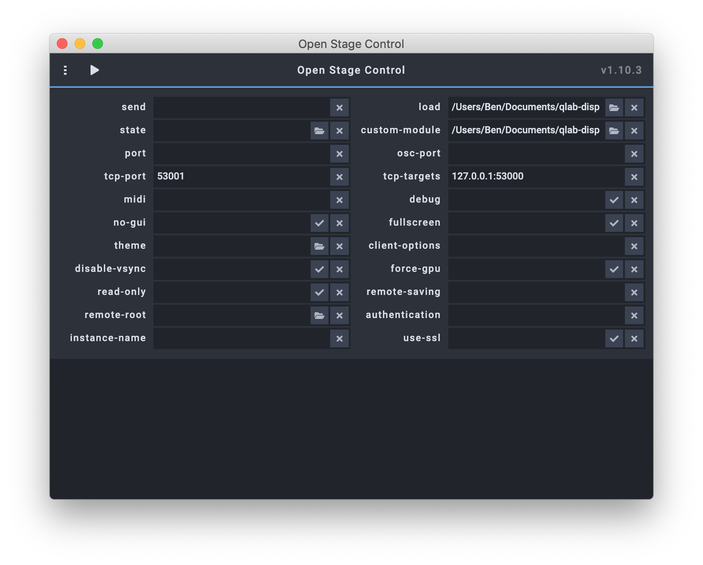
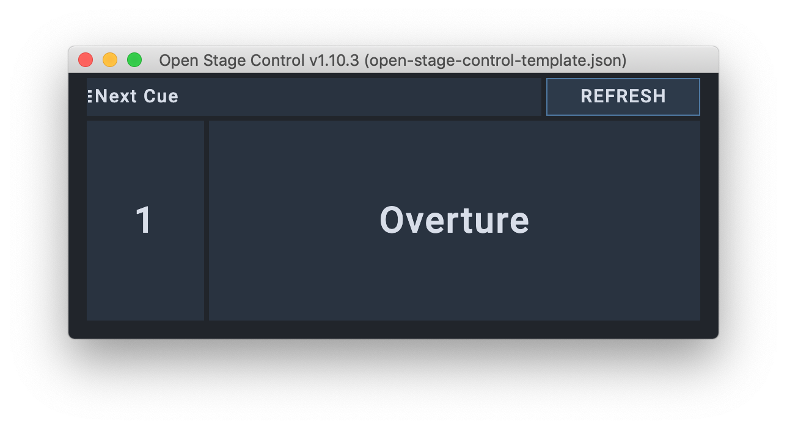

# Qlab Display

# Custom Module for Open Stage Control

This version runs entirely within the [Open Stage Control](http://openstagecontrol.ammd.net/) software, as a 'custom module'. It requests updates from Qlab when there are changes to the workspace, and interprets the responses appropriately - the module ignores responses which do not relate to the playhead position of the chosen cue list.

You can run the module with either a UDP or TCP connection to Qlab. I recommend using TCP, as this maintains a permanent connection to Qlab, increasing reliability, but with minimal CPU overhead. If you wish to use UDP, you must send a thump (heartbeat) message to Qlab to maintain the connection – to enable this, at the top of the module, edit the variable `useTCP = false`.

## Open Stage Control setup

- First, put the 'open-stage-control-module' folder on the computer you wish to run the server from. Ensure this is on the network, and file sharing is enabled.
- Then, on your Qlab computer, navigate to the folder over the network and open 'Get-IDs.applescript' in script editor.
  - Ensure your Qlab file is open, the front-most Qlab file if there are multiple, and that the current cue list is the one you wish to monitor.
  - Run the 'Get-IDs' script - this will create 'qlab-info-config.json' in the root folder.
  - The first dialog box asks you to define the Qlab computer
    - If you only have a single Qlab computer, select "Only" when prompted to define this Qlab machine.
    - If you have a main and a backup Qlab computer, run this script first on the "Main", then repeat this process on the "Backup", and the script will append the necessary information on the end of the config file.
  - The second dialog box asks you which local IP address you wish to use. If your computer is on multiple networks, e.g. a control network and a [Dante](https://www.audinate.com/meet-dante/what-is-dante) network, this allows you to select the correct one.
  - Settings for Backup computers are not used in the current release, but will be implemented in an imminent release.
- Open **Open Stage Control**.
- Set the following settings in the launcher, using files from the `open-stage-control-module` folder:
  - **load**: select the file `open-stage-control-template.json`
  - **custom-module**: select the file `get-cue-list-playhead.js`
  - **port**: this is the port that the web server is served to. Leave this blank to use the default 8080.
  - **no-gui**: if you do not want this open on the device which is the server, set this to true.
  - **IF USING UDP**
    - **osc-port**: set 53001. This is the port it will listen for replies from.
    - Ensure you also edit the variable useTCP to "false" in `get-cue-list-playhead.js`
  - **IF USING TCP**
    - **tcp-port**: set 53001. 
    - **tcp-targets**: set \[Qlab IP\]:53000 (e.g. `127.0.0.1:53000`). If using backup as well, separate the two settings with a space.
    - Leave the variable useTCP as "true" in `get-cue-list-playhead.js`
- Now, click start to launch the OSC & web server.

One method for using this would be loading Open Stage Control on a non-Qlab computer at FOH, so that the Sound Operator can see the display and notice if there are any issues. The remote computer for viewing can then simply navigate to the web server to view the display.

# Node JS version

## Methods

This script has several versions for displaying the result:
- `qlab-mon.js` displays the current playhead in terminal.
- `qlab-mon-streamdeck.js` displays the current playhead on 2 buttons on a streamdeck, which can be on a separate computer to that running the script if desired.
- `qlab-mon-open-stage-control.js` displays the current playhead in the software "open stage control", which can also be run on either the same or a remote computer, and can also be viewed over the network in a web browser.

## Installation

1. Clone this repository, or download and expand the zip.
2. Ensure you have installed [node.js](https://nodejs.org/en/).
3. In terminal, set the repository folder as the directory, e.g: `cd Documents/qlab-display`.
4. In terminal, enter `npm install` to install all dependencies of the project.
5. To set variables to allow the scripts to work on your system, open config.yml in a text or code editor. Here, you can set:
   - Production information:
      - Production name
      - Cue list name
      - Config version (in case you make changes to your network)
   - Cue list number
   - Qlab information:
      - IP address
      - Port to send to
      - Port replies come from
   - Display information:
      - IP address
      - For Open Stage Control:
         - Port
         - OSC address for displaying cue number
         - OSC address for displaying cue name
         - OSC address for a heartbeat indicator
      - For Streamdeck:
         - Port
         - Companion page number
         - Companion button number for Q Number
         - Companion button number for Q Name
6. You can also set most of these variables from the command line, which could be particularly useful for cue list numbers and OSC ports.

## Operation

Choose which version of the script you wish to use: in `package.json`, change the filename under "main" to be that script. By default, I've set this to `qlab-mon-open-stage-control.js`.

In terminal, enter: `node .`. Leave this terminal window open, and it will constantly send Qlab a message every 0.5s (by default) to request the playhead position on the cue list specified.

### Command Line Variables

You can control several variables when launching the scripts - simply add the following after `node .` if you desire.

- `--cuelist, -q`, to set the cue list number to monitor
- `--qlabip, --qi`, to set the IP address for qlab
- `--qlabport, --qp`, to set the OSC port to send to qlab
- `--displayip, --di`, to set the IP address for the computer running the display (Companion or Open Stage Control)
- `--displayport, -d`, to set the OSC port of the display software
- `--companionpage, --cp`, on streamdeck to set the page to display the information
- `--cuenumberbutton, --cqnum`, on streamdeck to set the button which displays the cue number
- `--cuenamebutton, --cqname`, on streamdeck to set the button which displays the cue name
- `--help, -h` to see a list of all available options on the script you're using

### qlab-mon.js

The terminal window will display the number and name of the playhead position, updating automatically every 0.5s.

### qlab-mon-streamdeck.js

If you have Bitfocus Companion open, the buttons you set should update automatically.

### qlab-mon-open-stage-control.js

Once you start Open Stage Control on the correct port, with the correct template open, this template should update.

If you are using the included template, `open-stage-control-template.json`, try setting this file in the "load" option before clicking the 'play' button to start Open Stage Control. This will automatically load the file, and enable you to log into, for example, http://127.0.0.1:7000 remotely and see this information too.

## Limitations

To use this method, the cue list you wish to monitor must have a cue number. e.g., for "Click Tracks", you might number the cue list "CLICK".

# Screenshots

## Open Stage Control Custom Module

### Launching Open Stage Control Module (using TCP)

### Open Stage Control Module

### Module disconnected from Qlab

## Node.js Version

### Launching the script from the macOS terminal

### Setting custom options when launching the script from the macOS terminal

### The Qlab Display working in Open Stage Control

### Qlab Display when Qlab has disconnected

