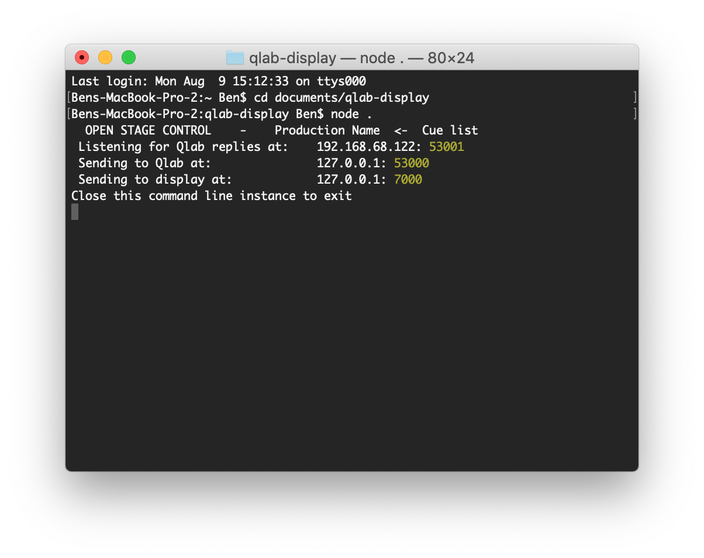
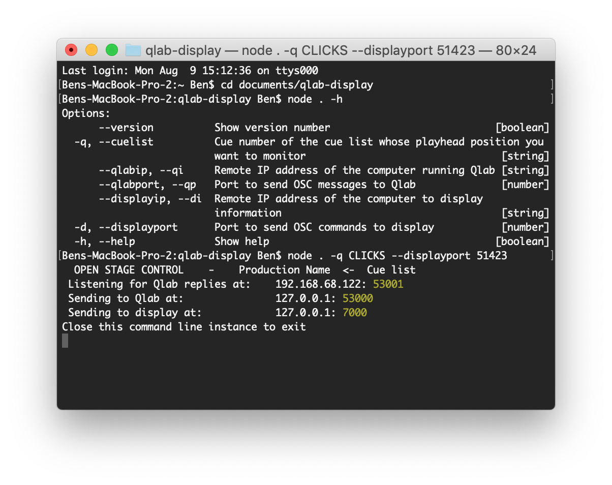
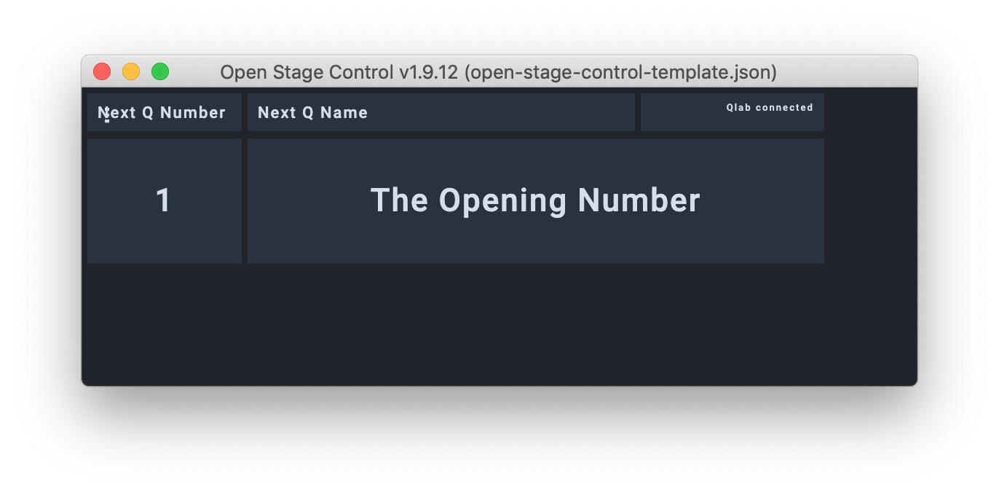
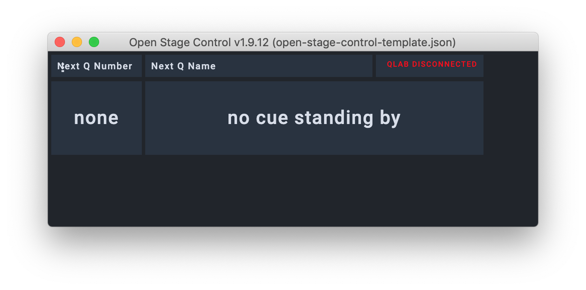

# Qlab Display

## Methods

This script has several versions for displaying the result:
- `qlab-mon.js` displays the current playhead in terminal.
- `qlab-mon-streamdeck.js` displays the current playhead on 2 buttons on a streamdeck, which can be on a separate computer to that running the script if desired.
- `qlab-mon-open-stage-control.js` displays the current playhead in the software "open stage control", which can also be run on either the same or a remote computer, and can also be viewed over the network in a web browser.

## Installation

1. Clone this repository, or download and expand the zip.
2. Ensure you have installed [node.js](https://nodejs.org/en/).
3. In terminal, set the repository folder as the directory, e.g: `cd Documents/qlab-display`
4. Open the script you wish to use in a text or code editor, and enter the correct values in the "Variables" sections. This includes:
   - `cueListNumber`: the cue number of the cue list to monitor
   - `qlabIP`: the IP address of the Qlab machine. If this is localhost, use "127.0.0.1"
   - `qlabPort`: the port Qlab is listening for OSC commands on, by default 53000
   - `companionIP` or `openStageControlIP`: the IP address of the computer running either Bitfocus Companion (for streamdeck) or Open Stage Control.
   - `companionPort` or `openStageControlPort`: the port which the above devices are listening for OSC on.
   - `companionPage`: the page on your Streamdeck that you wish to see the indicator.
   - `companionQNumButton` and `companionQNameButton`: the number of the buttons on that page which you would like to display the cue number and the cue name.
   - `openStageControlQNum` and `openStageControlQName`: the command to send to update elements with the cue number and cue name. The default works with the open-stage-control-template.json file included in this repository.
5. You can also set most of these variables from the command line, which could be particularly useful for cue list numbers and OSC ports.

## Operation

Choose which version of the script you wish to use: in `package.json`, change the filename under "main" to be that script. By default, I've set this to `qlab-mon-open-stage-control.js`.

In terminal, enter: `node .`. Leave this terminal window open, and it will constantly send Qlab a message every 0.5s (by default) to request the playhead position on the cue list specified in "Variables".

### Command Line Variables

You can control several variables when launching the scripts - simply add the following after `node .` if you desire.

- `--cuelist, -q`, to set the cue list number to monitor
- `--qlabip, --qi`, to set the IP address for qlab
- `--qlabport, --qp`, to set the OSC port to send to qlab
- `--displayip, --di`, to set the IP address for the computer running the display (Companion or Open Stage Control)
- `--displayport, -d`, to set the OSC port of the display software
- `--companionpage, --cp`, on streamdeck to set the page to display the information
- `--cuenumberbutton, --cqnum`, on streamdeck to set the button which displays the cue number
- `--cuenamebutton, --cqname`, on streamdeck to set the button which displays the cue name
- `--help, -h` to see a list of all available options on the script you're using

### qlab-mon.js

The terminal window will display the number and name of the playhead position, updating automatically every 0.5s.

### qlab-mon-streamdeck.js

If you have Bitfocus Companion open, the buttons you set should update automatically.

### qlab-mon-open-stage-control.js

Once you start Open Stage Control on the correct port, with the correct template open, this template should update.

If you are using the included template, `open-stage-control-template.json`, try setting this file in the "load" option before clicking the 'play' button to start Open Stage Control. This will automatically load the file, and enable you to log into, for example, http://127.0.0.1:7000 remotely and see this information too.

## Limitations

To use this method, the cue list you wish to monitor must have a cue number. e.g., for "Click Tracks", you might number the cue list "CLICK".

## Screenshots

Launching the script from the macOS terminal

Setting custom options when launching the script from the macOS terminal

The Qlab Display working in Open Stage Control

Qlab Display when Qlab has disconnected